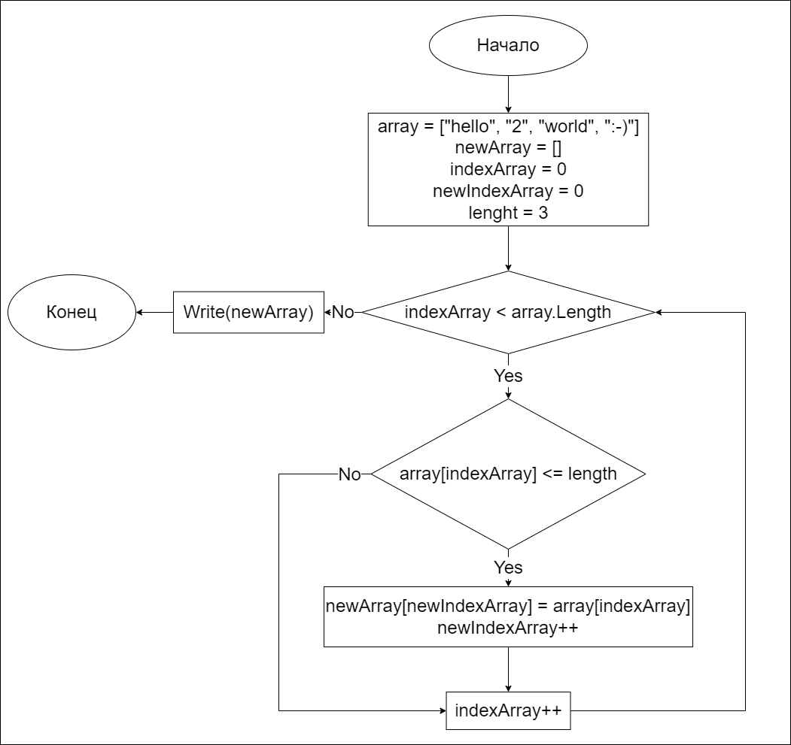

## Итоговая задача: ##
_Написать программу, которая из имеющегося массива строк формирует массив из строк, длина которых меньше либо равна 3 символа. Первоначальный массив можно ввести с клавиатуры, либо задать на старте выполнения алгоритма. При решении не рекомендуется пользоваться коллекциями, лучше обойтись исключительно массивами._

## Например: ##

["hello", "2", "world", ":-)"] -> ["2", ":-)"]

["1234", "1567", "-2", "competer science"] -> ["-2"]

["Russia", "Denmark", "Kazan"] -> [ ]

## Решение задачи блок-схемой: ##

## Текстовое описание решения задачи: ##
* _Необходимо задать стартовые значения._
* _Следует произвести ряд проверок, например:_
    * _создать проверку на обход всех элементов массива;_
    * _создать проверку длины символов по условию задачи;_
* _затем подходящие элементы записать в новый массив, а неподходящие пропустить._
* _после перебора всех элементов, вывести на экран новый массив._